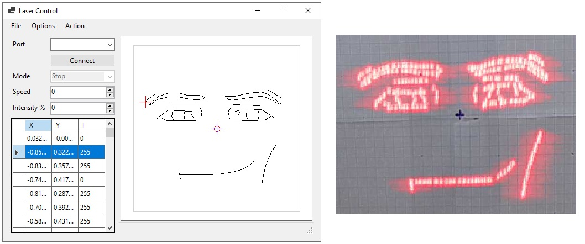

# Laser Control System: Two-Axis Motorized Scanner

This project provides a control panel software and device firmware for a two-axis motor-driven laser scanner.

Trajectory playback demo.

## Features
* **Real-time Control:** Intuitive control panel for laser positioning and activation.
* **Targeting Path Editor:** Allows to define specific target points or scan paths.
* **Real-time Visualization:** Visualizes trajectory playback status.
* **Stationary Operation:** Designed to operate without movement of the laser or the researched sample.
* **Flexible Configuration:** Configure and calibrate the system to achieve expected accuracy, scanning speed, and surface area size.

## [Getting Started](docs/main.md)

## License

This project is licensed under the MIT License. See the [LICENSE](LICENSE) file for details.
