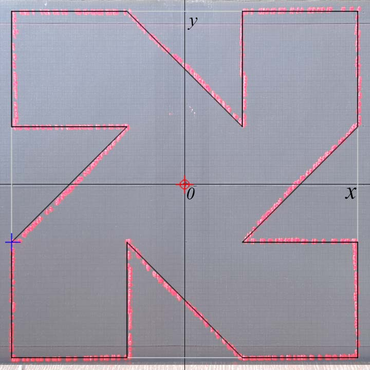

## Hardware Requirements
 - Arduino compatible board with UART support
 - two stepper motors controlled directly or via step-dir interface
 - laser connected via PWM interface.

## Software Features

The software is a control panel for a laser device with the following appearance:

### Device Control

Laser control panel provides 4 control modes:
 - Stop - switching to this returns the laser to the origin and turns it off.
 - Manual - laser moves to the selected target in the trajectory.
 - Auto - device playbacks trajectory from selected target to the end of the trajectory.
 - Repeat - the same as auto but trajectory is looped.

Target consists of laser coordinates and it's intensity value [0; 1].

Also laser can be controlled from screen visualization panel, that also previews the trajectory on it.
For easier navigation the screen surface photo can be set as a background in Menu -> Options -> Choose Background.

### Trajectory editor
Editor posibilities:
 - Add target - RMB click on the screen visualization panel (later SVP) will add new target with the cursor coordinates and laser intensity if previously selected point. Press CTRL or SHIFT to fix axis X or Y.
 - Select target - target can be selected from the target list, or from the SVP by clicking ALT + LMB, the clothest target to the cursor will be selected.
 - Edit target - LMB on the SVP moves selected target to cursor, also it is possible to enter target data manually in target list. Axises are also fixable as for adding targets. Also it is possible to toggle laser on target by clicking RMB on the intensity value cell in the target list.
 - Delete target - DELETE key deletes selected target.

Trajectories can be exported to CSV in Menu -> Export trajectory and imported in Menu -> Import trajectory.

## Firmware configuration
The firmware options are configured in [Configuration.h](../firmware/Configuration.h) and [Configuration.cpp](../firmware/Configuration.cpp) files:
 - laserPin - pin number connected to the laser module.
 - baudRate - communication speed with the Arduino board (default 9600 bauds is enough for 100 trajectory points/sec).
 - driverType - enum that declares used motors interface type (STEPPER4WIRE_HALF, STEPPER2WIRE, STEPPER4WIRE, STEPPER4WIRE_HALF are available), details in "GyverStepper/src/StepperCore.h".

## Device configuration
Device parameters are set in the Device Profile according to the device's characteristics:
- device dimentions:
  - screen size
  - screen distance
  - mirror distance

- motor properties:
  - motor steps per full rotation
  - is axis x inverted
  - is axis y inverted
  - max speed - max stepper motor speed in steps

- calibration data:
  - axis x backlash - count in steps to compensate on laser direction change on axis x
  - axis y backlash - count in steps to compensate on laser direction change on axis y
  - compensation grid data

To compensate device backlash move the laser in opposite directions of an every axis and find the value for an every axis when laser moves on equal distance in both directions.

To compensate trajectory deviation caused by device imperfections the compensation grid is used (assuming previous configuration steps are performed):

1. Open Menu (press ALT) > Configure Device
2. Playback calibration trajectory and record deviations of the real trajectory from programmed.
3. Set the grid values to the opposite of the trajectory deviation.

Example:
A device is configured for 0.3x0.3m surface with grid cell size 5mm.

Pre-calibration condition:

Compensation grid data:

Result after calibration:

Configurations can be exported to JSON in Menu -> Export trajectory and imported in Menu -> Import trajectory.
